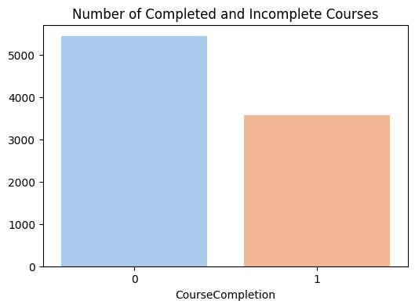
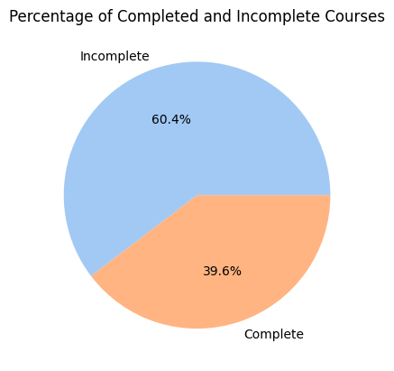

# Student Course Engagement Analysis 

## 📊 Overview
This project analyzes student engagement in an online course to understand behavior patterns and factors influencing course completion.

## 🛠️ Tools
- Python (Pandas)
- Matplotlib, Seaborn
- Google Colab

## 🔍 Steps
- Data Cleaning  
- Outlier Detection (IQR)  
- Exploratory Data Analysis (EDA)  
- Data Visualization  

## 📈 Key Insights
- Course completion rate is lower than non-completion  
- Students who spent more time and engaged more were more likely to complete the course  
- Data cleaning improved dataset quality by removing duplicates  
- Outlier detection helped identify unusual engagement behavior  

## 🚀 How to Run
- Open the notebook in Google Colab  
- Upload dataset  
- Run all cells

- ## 📊 Results

### 📈 Completion Distribution

### 📊 Completion Percentage

